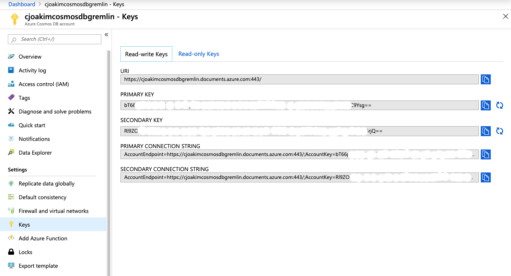

# azure-cosmosdb-graph-npm

An example Bill-of-Material application with NPM data using Azure CosmosDB Graph/Gremlin database.

## Links

- https://www.npmjs.com
- 
- https://gist.github.com/anvaka/8e8fa57c7ee1350e3491
- https://docs.microsoft.com/en-us/javascript/api/overview/azure/?view=azure-node-latest


## Azure Setup

Provision an Azure CosmosDB instance, in your subscription, which uses the Gremlin API.

Then create a new collection in your CosmosDB Graph database, as shown below.
A database named **dev** with collection named **npm** is recommended.
Specify a partition key named **/pk** and 10,000 RUs.


Then go to the **Keys panel**, as shown below, and set the following **environment variables** 
on your computer based on the values you see in Azure Portal.



Note, the **values** shown below are just examples; your values will be different.

```
AZURE_COSMOSDB_GRAPHDB_ACCT=cjoakimcosmosdbgremlin
AZURE_COSMOSDB_GRAPHDB_COLNAME=npm
AZURE_COSMOSDB_GRAPHDB_CONN_STRING= ...secret...
AZURE_COSMOSDB_GRAPHDB_DBNAME=dev
AZURE_COSMOSDB_GRAPHDB_GRAPH=npm
AZURE_COSMOSDB_GRAPHDB_VIEWS=views
AZURE_COSMOSDB_GRAPHDB_KEY= ...secret...
AZURE_COSMOSDB_GRAPHDB_URI=https://cjoakimcosmosdbgremlin.documents.azure.com:443/

PORT=3000  (Also add this environment variable for the localhost webserver port)
```


## Batch Processing Overview

The batch processing does the following:
1) Starts with a hand-edited list of **seed** npm libraries that are interesting to you.

2) Programatically invoke the **npm cli** to recursively **Spider** npm for information about each library.
   - The spider process starts with your hand-edited list of seed npm libraries
   - The spider will iterate n-number of times to get the dependencies of those seed libraries
   - Then dependencies of those libraries, and their dependencies, etc, etc

3) Wrangle the JSON files for each library that are captured in the Spidering process.

4) Generate Gremlin load statements, from the Wrangled data, to insert the **Vertices** and **Edges** for the npm graph.
   - The **Vertices** are the npm libraries as well as their **Maintainers**
   - **Edges** connect one library to another in a **uses** or **used_by** relationship
   - **Edges** also connect the **Maintainers** to each **Library** they maintain
   - Currently there isn't a **knows** Edge from one Maintainer to another within a Library.

5) Load the Azure CosmosDB/Graph database from the generated Gremlin statements

### Batch Processing Detail

Since npm and thus JavaScript is the subject of this Graph, the implementation code is Node.js.
This Node.js code is portable to Windows, Linux, and macOS.  Both Linux and macOS bash shell 
scripts (*.sh) and Windows PowerShell Scripts (*.ps1) are provided in this repo.

First clone this repository and install the npm libraries necessary for this project
in the project root directory.
```
$ git clone https://github.com/cjoakim/azure-cosmosdb-graph-npm.git
$ cd azure-cosmosdb-graph-npm
$ mkdir tmp

$ npm install 
```

Edit file **seeds.txt*, the execute the following:
```
$ node main.js seed2json
```
This creates file data/seed_libraries.json

Then execute the npm Spidering process, with 10 iterations.
```
$ ./spider_npm.sh
```

The above Spidering process may take an hour or two to execute, depending on the number
of seed libraries and your network bandwidth.

Then execute the data-wrangling and gremlin-statement-generation process:
```
$ ./wrangle_npm_data.sh
```

Note that the Spidering process is intentionally decoupled from the Wrangling process,
and that intermediate files are produced by the Wrangling process to increase clarity
and understanding.

Finally, load your Azure CosmosDB database with the generated file **data/gremlin/gremlin_load_file_uniq.txt**.

TODO...

## Web Application

The Web Application for this project is implemented with Node.js and the Express
web framework.  D3.js is used in the client-side browser code for Graph Visualization.

TODO...

# Gremlin Queries

```
g.V("LIB-m26-js")
g.V("LIB-m26-js").inE()
g.V("LIB-m26-js").outE()

g.V("LIB-tcx-js").bothE()

g.V(["LIB-m26-js", "LIB-m26-js"]).inE().limit(10).as('e').outV().as('v').select('e', 'v') 
g.V(["LIB-m26-js", "LIB-m26-js"]).outE().limit(11).as('e').inV().as('v').select('e', 'v') 

```
